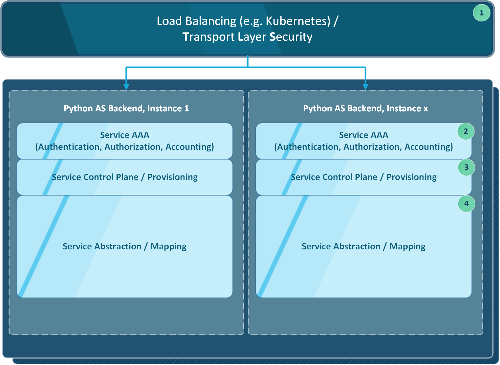

.. design

======
Design
======

1. Overview
===========

The following diagram shows the *Base Layout / Model* of a **scalable**
*SOA / ESB Infrastructure*.

- Loadbalancing Layer (1)
- Transport Layer Security Layer (1)
- AAA / Authentication, Authorization, Accounting Layer (2)
- Service Control Plane / Provisioning Layer (3)
- Service Mapping / (Python) OOP Abstraction Layer (4)

.. note::
    The **microesb** module focuses on the "Service Mapping / Abstraction Layer" (4).

.. note::
    The "Loadbalancing Layer" and the "Transport Layer Security Layer" easily can be
    adapted using a Kubernetes Cluster / Ingress-nginX (see "Example #2").

2. Centralized Service Management
=================================

The larger the IT infrastructure, the more important it is to build a generic, centralized
Service Oriented Architecture.

.. image:: images/microesb-centralized-service-mm.png
  :alt: Image - Micro-ESB Centralized Service Management

2.1. Implementation Workflow
****************************

The common workflow in a CI driven, recurring, agile Devlopment Process.

1. Build Infrastructure
2. Build Application
3. Test
4. Deploy
5. Maintain

2.2. Standards / Generic Aproach
********************************

Our goal should be to reduce the effort dependent on point 1 and the resulting
(correspondingly high) periodic recurring costs.

The better *Standards / Infrastructural Templates* are organized, the more developers can
focus on the *Development Process*. Especially in large, agile development teams, it is
essential to adapt the IP infrastructure to constantly changing needs without a lot of
(sometimes even bureaucratic) effort.

A well designed, documented, automatically updated, centralized, generic **Services Registry**
component inside SOA will help developers saving a lot of headaches.

.. note::
    This needs a lot of RFC / standardization work to be done.

2.3. External Service Integration
*********************************

Also, don’t forget the numerous external (rented) services that need to be managed at all
levels inside your company.

- Metrics / Statistics
- Authentication

.. note::
    *Wrapping* these external services into a centralized SOA also could be a good idea.

3. Service Mapping
==================

The focus of the Python **microesb** module is to map a clean JSON metadata service schema
to internal OOP based Python class instances / methods.

.. note::
    A detailed example including transactional database access see "Example #1".

4. Platform As A Service
========================

...
