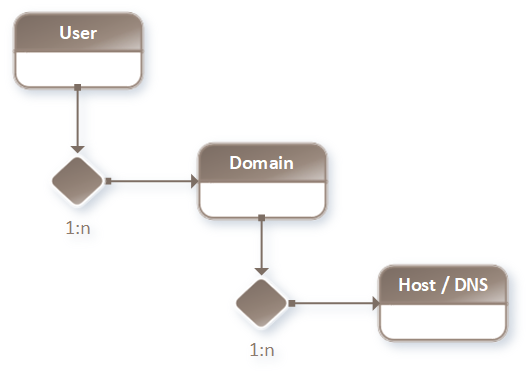

.. examples

.. _examples-global:

========
Examples
========

.. _example-number1:

1. Hosting Use Case
===================

In this example number 1, assume our "virtual" company runs a
**Hosting Business**.

The companies customer data including a) Internet Domains and b) DNS Hostnames
should be manageable by different sub systems.

.. note::

    Example number 1 will only cover Local Service Mapping **without**
    *Python Application Server* / *Multi-Tier* abstraction.

.. note::

    In example number 3 we will dig a little deeper and include those aspects,
    even *Service Scaling* and *Load Balancing*.

1.1. Basic OOP Relations
************************

The hosting service offers the customer to buy (add, delete) domains and manage
the domains DNS host entries (add, update, delete).

.. code-block:: bash

    - Customer
      + Domain(s)
        + Hostname(s)

- Customer has 1:n relation to Domain
- Domain has 1:n relation to Host

1.2. Relations Diagram
**********************

1.3. Encapsulation / Domain Data
********************************

It is a common design approach to encapsulate each logical segment into a
single, separated "flat" service endpoint.

1. Separated (parametrized) insertDomain
2. Separated (parametrized) updateDomain
3. Separated (parametrized) deleteDomain
4. Separated (parametrized) insertHost
5. Separated (parametrized) updatetHost
6. Separated (parametrized) deletetHost

Imagine this like a simple, parametrized function() call / "flat", non-hierachical.

1.4. Encapsulation The Better Way
*********************************

We could do this much easier, preserve (database) transactions and save a lot
of administrative / maintaining effort.

If we could already process structured hierachical metadata in the service input,
these endpoints would be reduced to the following.

1. Separated (hierachical metadata) insertUserDomain
2. Separated (hierachical metadata) updatetUserDomain
3. Separated (hierachical metadata) deleteUserDomain

.. note::

    Also the microesb`s service processing is able to handle multiple (list)
    user requests containing domain / host data in one single webservice call.

.. note::

    Example number 1 only covers 1. "insertUserDomain".

1.5. Example Call Meta-Data
***************************

The following example service call metadata will instruct the backend to do
the following tasks when using backend configuration from section
:ref:`backend-config` and code from section :ref:`python-implementation`.

1. Loop on User [ "testuser1" ]
2. Start database transaction
3. Get user id by user name
4. Insert Domain "testdomain1.com" if it does not exist
5. Insert Hostname (MX type) with value "mx01.mailserver.com" and priority 1
6. Insert Hostname (A type) with value "mx01.mailserver.com" and ttl 36000 seconds
7. Commit on success or rollback database transaction on failure

.. literalinclude:: ../../example/01-hosting-use-case/service_call_metadata.py
    :linenos:

1.6. Database Tables (PostgreSQL)
*********************************

The following database tables are used in this example.

- sys_core."user"
- sys_core."domain"
- sys_dns."dnsrecord"

The following SQL code is an excerpt (create tables) of the complete database creation
SQL script found in the example folder.

.. literalinclude:: ../../example/01-hosting-use-case/02-create-table.sql
    :linenos:

.. _backend-config:

1.7. Backend Config / Service Mapping
*************************************

The following dictionary data describes how to configure the **microesb`s**
backend to run this example.

1.7.1. Service Property Mapping
-------------------------------

.. literalinclude:: ../../example/01-hosting-use-case/service_properties.py
    :linenos:

1.7.2. Hierachical Class Reference
----------------------------------

.. literalinclude:: ../../example/01-hosting-use-case/class_reference.py
     :linenos:

1.7.3. Class Mapping
--------------------

.. literalinclude:: ../../example/01-hosting-use-case/class_mapping.py
    :linenos:

.. _python-implementation:

1.8. Python Implementation
**************************

The following code covers the implementation part.

1.8.1. Class Definition
-----------------------

.. literalinclude:: ../../example/01-hosting-use-case/service_implementation.py
    :linenos:

1.8.2. Main / Service Call
--------------------------

.. literalinclude:: ../../example/01-hosting-use-case/main.py
    :linenos:

Change to the example path and execute the main.py file.

.. code-block:: bash

    python3 ./main.py

1.8.3. Post Excecution
----------------------

After executing you will find the new created domain inside sys_core."domain"
table and two related host records inside sys_dns."dnsrecord" table.

.. note::

    There are no unique constraints which forbid multiple dns entry inserts,
    calling the script multiple times duplicates dns records.

.. _example-number2:

2. PKI Provisioning / Class Types
=================================

Example number 1 only covers a "plain" database model without local (e.g. bash)
or remote (webservice) invocations.

Example number 2 is a "tiny" excerpt of the Python implementation of PKI
management (smartcard and keys on smartcard). This includes local execution
of *opensc* "pkcs11-tool" and "pkcs15-tool" shell scripts.

.. note::

    This example is a stripped-down excerpt from PKI management to show how
    *virtual class types* work.

2.1. Object Abstraction
***********************

.. code-block:: bash

    - Smartcard
      + SmartcardContainer
    - Certificate
      + SmartcardCAKeyRef
      + SmartcardREQKeyRef
    - Certificate Types
      + Certificate (Type Certificate Authority)
      + Certificate (Type Server)
      + Certificate (Type Client)

.. note::

    Simplified, if you will generate a Server Certificate you probably need two
    Private Keys, a) CA Cert Private Key (signing) and b) Server Cert Private Key
    which can reside on different HSMs (Hardware Security Modules / Smartcards).

2.2. Service Logic
******************

Our example use case is to generate a Server Certificate with an existing CA
Private Key on Smartcard #1 and a Private Key Pair should be generated on
Smartcard #2.

2.3. Service Mapping / Differences
**********************************

2.4. Implementation
*******************

3. SOA on Kubernetes
====================

Example including working docker container(s) / Kubernetes Minikube setup
on the way (right after FalconAS milestone "HTTP1/1 implementation" has been adapted).

See: https://github.com/WEBcodeX1/http-1.2
