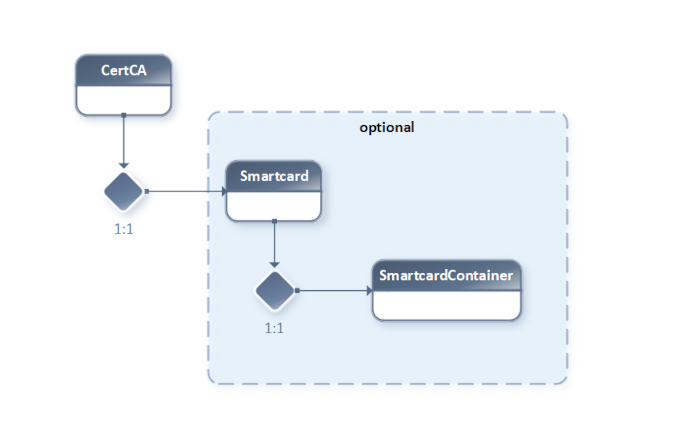
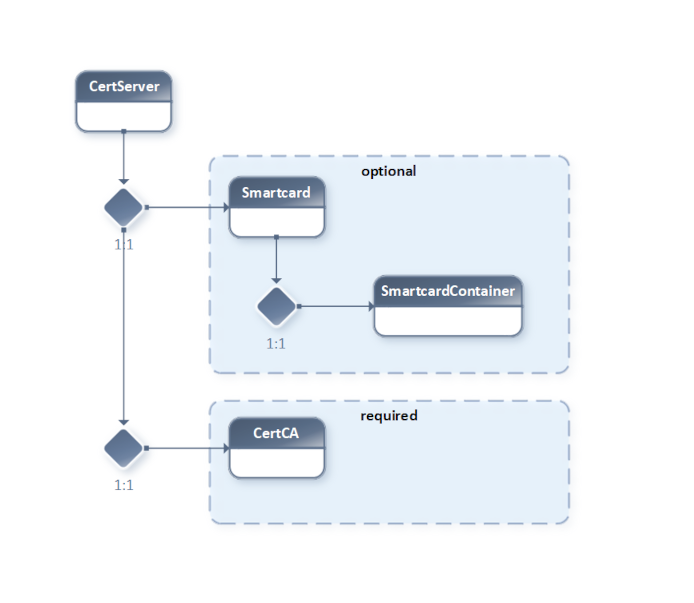
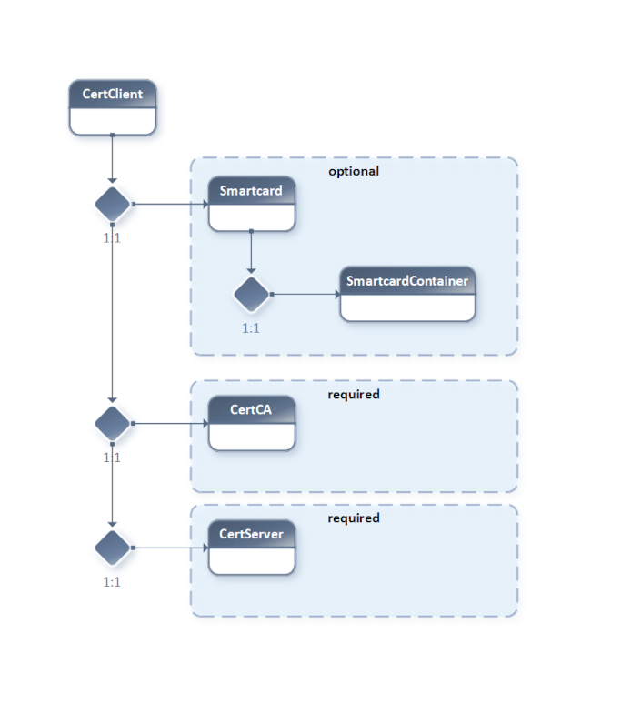

.. examples

.. _examples-global:

========
Examples
========

.. _example-number1:

1. Hosting Use Case
===================

In this example, assume our "virtual" company runs a **Hosting Business**.

The company's customer data, including a) Internet Domains and b) DNS Hostnames, should be manageable by different subsystems.

This example demonstrates the integration with **PostgreSQL database transactions**, showcasing how the microesb framework handles atomic operations across multiple related entities while maintaining data integrity through commit/rollback mechanisms.

.. note::

    Example number 1 will only cover Local Service Mapping **without** *Python Application Server* encapsulation.

.. note::

    In example number 4, we will explore these aspects further, including *Service Scaling*, *Load Balancing* and *Service Authentication*.

1.1. Basic OOP Relations
*************************

The hosting service allows customers to buy (add, delete) domains and manage their domains' DNS host entries (add, update, delete).

.. code-block:: bash

    - Customer
      + Domain(s)
        + Hostname(s)

- Customer has a 1:n relation to Domain.
- Domain has a 1:n relation to Host.

1.2. Relations Diagram
**********************

.. image:: images/microesb-example1-object-relations.png
    :alt: image - microesb example1, relations
    :width: 694px

1.3. Encapsulation / Domain Data
*********************************

A common design approach is to encapsulate each logical segment into a single, separate "flat" service endpoint.

1. Separated (parametrized) insertDomain
2. Separated (parametrized) updateDomain
3. Separated (parametrized) deleteDomain
4. Separated (parametrized) insertHost
5. Separated (parametrized) updateHost
6. Separated (parametrized) deleteHost

Think of these as simple, parametrized function calls—"flat," non-hierarchical.

1.4. Encapsulation: The Better Way
**********************************

This can be simplified to preserve database transactions and reduce administrative overhead. By processing structured hierarchical metadata in the service input, these endpoints can be reduced to:

1. Separated (hierarchical metadata) insertUserDomain
2. Separated (hierarchical metadata) updateUserDomain
3. Separated (hierarchical metadata) deleteUserDomain

.. note::

    The **microesb** service processing can handle multiple (list-based) user requests containing domain/host data in a single web service call.

.. note::

    Example number 1 only covers `insertUserDomain`.

1.5. Example Call Meta-Data
***************************

The following example service call metadata instructs the backend to perform these tasks based on the backend configuration in section :ref:`backend-config` and code in section :ref:`python-implementation`:

1. Loop on User ["testuser1"].
2. Start a database transaction.
3. Get the user ID by username.
4. Insert the domain "testdomain1.com" if it does not exist.
5. Insert a Hostname (MX type) with value "mx01.mailserver.com" and priority 1.
6. Insert a Hostname (A type) with value "mx01.mailserver.com" and TTL of 36,000 seconds.
7. Commit on success or roll back the database transaction on failure.

.. literalinclude:: ../../example/01-hosting-use-case/service_call_metadata.py
    :linenos:

1.6. Database Tables (PostgreSQL)
*********************************

The following database tables are used in this example:

- `sys_core."user"`
- `sys_core."domain"`
- `sys_dns."dnsrecord"`

Below is an excerpt of the SQL script for creating these tables:

.. literalinclude:: ../../example/01-hosting-use-case/02-create-table.sql
    :linenos:

.. _backend-config:

1.7. Backend Config / Service Mapping
*************************************

The following dictionary describes how to configure the **microesb** backend to run this example.

1.7.1. Service Property Mapping
-------------------------------

.. literalinclude:: ../../example/01-hosting-use-case/service_properties.py
    :linenos:

1.7.2. Hierarchical Class Reference
-----------------------------------

.. literalinclude:: ../../example/01-hosting-use-case/class_reference.py
    :linenos:

1.7.3. Class Mapping
--------------------

.. literalinclude:: ../../example/01-hosting-use-case/class_mapping.py
    :linenos:

.. _python-implementation:

1.8. Python Implementation
**************************

The following Python code demonstrates the implementation.

1.8.1. Class Definition
-----------------------

.. literalinclude:: ../../example/01-hosting-use-case/service_implementation.py
    :linenos:

1.8.2. Main / Service Call
--------------------------

.. literalinclude:: ../../example/01-hosting-use-case/main.py
    :linenos:

1.8.3. Passing Parameters
-------------------------

To enable database transactions (disabled autocommit), open the database connection in `main.py` and pass it into the implementation code.

In `service_properties.py` (lines 10–15), define the property with ID `dbcon` to pass the database connection.

.. code-block:: python

    'dbcon': {
        'type': 'classref',
        'default': None,
        'required': True,
        'description': 'Database Connection Ref'
    }

In `main.py` (line 24), set the `dbcon` value in the service call metadata dictionary.

.. code-block:: python

    service_metadata['data'][0]['User']['dbcon'] = dbcon

1.8.4. Execute Example
----------------------

Navigate to the example directory and execute the `main.py` file.

.. code-block:: bash

    python3 ./main.py

1.8.5. Post-Execution
---------------------

After execution, the newly created domain will be in the `sys_core."domain"` table, with two related host records in the `sys_dns."dnsrecord"` table.

.. note::

    There are no unique constraints preventing duplicate DNS entries. Running the script multiple times will result in duplicate records.

.. _example-number2:

2. PKI Provisioning / Class Types
=================================

This example demonstrates PKI (Public Key Infrastructure) certificate provisioning with a focus on class type hierarchies and **NoSQL MongoDB backend integration**.

Unlike Example 1's relational database approach, this example showcases how the microesb framework seamlessly integrates with document-based NoSQL databases. MongoDB is used for storing and retrieving certificate metadata, demonstrating the framework's flexibility in handling both traditional and modern database paradigms.

The example implements a complete certificate generation workflow for:
- **Certificate Authority (CA)** certificates
- **Server** certificates
- **Client** certificates

Each certificate type can optionally use Hardware Security Module (HSM) / Smartcard integration for secure key pair generation. The implementation uses user-defined routing functions to interact with MongoDB for certificate storage and retrieval operations.

2.1. CA Certificate Relations
******************************

- CA == *Certificate Authority*
- HSM == *Hardware Security Module / Smartcard*

1. A CA is the root of a PKI (Public Key Infrastructure).
2. A functioning CA needs a *CA Certificate* signed by a unique Private Key (stored on a protected HSM or generated via software).

If no Smartcard / SmartcardContainer reference is provided, the Private Key used for the CA certificate will be generated by OpenSSL (marked **optional** in the diagram).

.. note::

    A CA can also be set up hierarchically (chain). This is called an **Intermediate CA**. Our example only covers *root CA* processing without chaining.

2.2. Server Certificate Relations
**********************************

When a *Server Certificate* is generated, a CA Certificate and its Private Key are required to ensure that the *Server Certificate* is issued by the correct CA.

To run a TLS-based server, the following components are needed:
- The *Server Certificate* (including the *Public Key*)
- The Server Certificate's Private Key
- The *CA Certificate* or *CA Certificate Chain* (if Intermediate CA is used)

.. note::

    The X.509 v3 Extensions (OIDs) of a certificate define its exact usage (e.g., Email Encryption, Transport Layer Encryption, etc.).

2.3. Client Certificate Relations
**********************************

To generate a *Client Certificate*, in addition to the CA Certificate and its Private Key, the relevant Server Certificate and its Private Key are also required.

2.4. Service Workflow
*********************

This example implements a Service Workflow for Certificate Generation for:
- *CertCA*
- *CertServer*
- *CertClient*

For all Certificate Types, the workflow checks if a Smartcard reference is provided:
- If yes, the keypair is generated on the card.
- If no, the Private Key is generated using OpenSSL.

If a Smartcard is referenced in the *Service Call Metadata*, related data is selected from the database. After successful Certificate Generation, relevant data is stored in the database.

.. note::

    To emphasize the workflow presentation, only dummy routines/methods and `print()` statements have been used for illustration.

2.5. Implementation
*******************

.. literalinclude:: ../../example/02-pki-management/service_implementation.py
    :linenos:

2.6. Clean OOP Model
********************

To achieve a clean OOP model in the implementation class hierarchy, the following design aspects are used:

.. note::

    *Virtual Class Types* require a Base Class inheriting `microesb.ClassHandler` and at least one *Child Class* inheriting the *Base Class*.

.. code-block:: python

    import abc

    class Cert(microesb.ClassHandler, metaclass=abc.ABCMeta):

        def __init__(self):
            super().__init__()

.. code-block:: python

    class CertCA(Cert):

        def __init__(self):
            self.type = 'ca'
            super().__init__()

2.6.1. Abstract Methods
-----------------------

The "Cert" base class provides three private abstract methods because the processing logic differs for each *Certificate Type*:

- `_load_ref_cert_data()`
- `_gen_openssl_cert()`
- `_insert_cert_db_data()`

.. code-block:: python

    class CertCA(Cert):

        def _load_ref_cert_data(self):
            pass

.. code-block:: python

    class CertServer(Cert):

        def _load_ref_cert_data(self):
            self.CertCA._get_cert_dbdata_by_id()

.. code-block:: python

    class CertClient(Cert):

        def _load_ref_cert_data(self):
            self.CertCA._get_cert_dbdata_by_id()
            self.CertServer._get_cert_dbdata_by_id()

2.6.2. Generic Template Methods
-------------------------------

The following methods are generic template methods inherited by each Child Class:

- `_gen_openssl_privkey()`
- `_get_cert_dbdata_by_id()`
- `_hsm_gen_keypair()`

2.7. Accessing Properties
*************************

The clean OOP model simplifies access to hierarchical Class Instance Properties.

All Virtual Implementation Class Instances can access their own Smartcard Container's
Label as follows:

.. code-block:: python

    self.Smartcard.SmartcardContainer.label

In `CertClient` and `CertServer`, it is also possible to access the `CertCA's` `Smartcard`
Properties (from Referenced Classes in Class Reference Config) to fill data from the database
inside `_get_cert_dbdata_by_id()`:

.. code-block:: python

    self.CertCA.Smartcard.SmartcardContainer.label

2.8. Class Import
*****************

The *Class Import Config* **must** include all *Implementation Classes* except the *Base Class(es)*.

.. literalinclude:: ../../example/02-pki-management/esbconfig.py
    :linenos:

2.9. Service Execution
**********************

Currently, the *Service Registry* feature is unimplemented. Execution is only possible as a single service for each *Certificate Type*.

2.9.1. CertCA Type
------------------

The following implementation demonstrates how to execute a `CertCA` type service:

.. literalinclude:: ../../example/02-pki-management/main-ca.py
    :linenos:

To execute the script, run:

.. code-block:: bash

    python3 ./main-ca.py

Expected output:

.. code-block:: bash

    Gen keypair on smartcard:smartcard_ca_card with keypair label:keypair_ca1
    Gen openssl cert type:ca.
    Insert cert data type:ca into db.

2.9.2. CertServer Type
----------------------

The following implementation demonstrates how to execute a `CertServer` type service:

.. literalinclude:: ../../example/02-pki-management/main-server.py
    :linenos:

To execute the script, run:

.. code-block:: bash

    python3 ./main-server.py

Expected output:

.. code-block:: bash

    Get cert data from db. Type: ca.
    Smartcard container label:testserver1_keypair
    Gen keypair on smartcard:smartcard_customer1 with keypair label:testserver1_keypair
    Gen openssl cert type:server, rel to CA.
    Insert cert data type:server into db.

2.9.3. CertClient Type
----------------------

The following implementation demonstrates how to execute a `CertClient` type service:

.. literalinclude:: ../../example/02-pki-management/main-client.py
    :linenos:

To execute the script, run:

.. code-block:: bash

    python3 ./main-client.py

Expected output:

.. code-block:: bash

    Get cert data from db. Type: ca.
    Get cert data from db. Type: server.
    Smartcard container label:testserver1_client1_keypair
    Gen keypair on smartcard:smartcard_customer1 with keypair label:testserver1_client1_keypair
    Gen openssl cert type:client, rel to CA and Server.
    Insert cert data type:client into db.

2.10. Class Reference
*********************

The root classes `CertCA`, `CertServer`, and `CertClient` must have their `property_ref` mapped to the 'Cert' properties defined in the *Service Properties Config*.

The following requirements must be met for successful referencing:
1. The *Class Reference* mapping (`property_ref`) must map to the *Base Class* (`Cert`).
2. The *Base Class* (`Cert`) must exist in the *Implementation*.
3. The *Base Class* (`Cert`) must be inherited by *Virtual Classes* (`CertCA`, etc.) in the *Implementation*.
4. Properties in the *Service Property Config* must be defined for the given *Base Class* (`Cert`).
5. The *Class Mapping Config* must include the *Virtual Classes* (`CertCA`, etc.).
6. *Virtual Classes* (`CertCA`, etc.) must be referenced in the *Import Configuration*.

The following is an example of a *Class Reference Config* containing all three certificate types (`CA`, `Server`, and `Client`):

.. literalinclude:: ../../example/02-pki-management/class_reference.py
    :linenos:

2.11. Class Mapping
*******************

The following is an example of the *Class Mapping Config*:

.. literalinclude:: ../../example/02-pki-management/class_mapping.py
    :linenos:

.. note::

    All *Virtual Class Types* must reference themselves in the mapping. Only *Alias Class Mapping* uses non-self-mapping (see :ref:`example-number3`).

2.12. Service Properties
*************************

The following is an example of the *Service Property Config*:

.. literalinclude:: ../../example/02-pki-management/service_properties.py
    :linenos:

2.13. Service Call Metadata
***************************

The following is an example of the *Service Call Metadata* for all certificate types:

.. literalinclude:: ../../example/02-pki-management/service_call_metadata.py
    :linenos:

.. _example-number3:

3. Hosting Use Case (Using DBPool)
==================================

Example number 3 is an exact copy of example number 1 with the difference that a database pooling mechanism `python-dbpool` is used.

Project information:

- https://github.com/clauspruefer/python-dbpool

.. _example-number4:

4. NLAP Integration
===================

Example number 4 will be added on NLAP (Next Level Application Protocol) completion.

Ongoing project status can be viewed here:

- https://www.der-it-pruefer.de/network/Exemplary-HTTP-Processing-Protocol-Design
- https://github.com/WEBcodeX1/http-1.2
