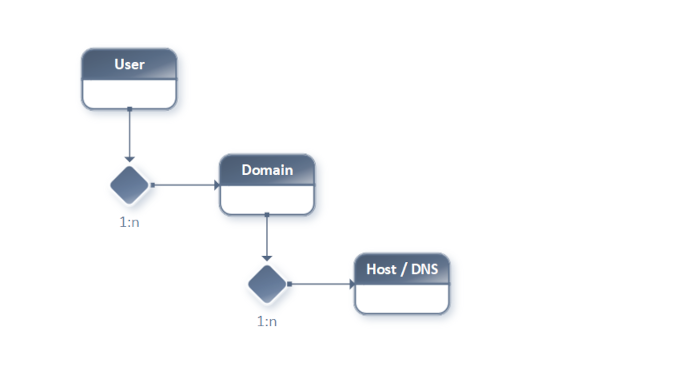

# Example 1: Hosting Use Case

In this example, assume our "virtual" company runs a **Hosting Business**.

The company's customer data, including a) Internet Domains and b) DNS Hostnames, should be manageable by different subsystems.

> **Note:** Example number 1 will only cover Local Service Mapping **without** a *Python Application Server* encapsulation.

> **Note:** In example number 4, we will explore these aspects further, including *Service Scaling*, *Load Balancing* and *Service Authentication*.

## 1.1. Basic OOP Relations

The hosting service allows customers to buy (add, delete) domains and manage their domains' DNS host entries (add, update, delete).

```
- Customer
  + Domain(s)
    + Hostname(s)
```

- Customer has a 1:n relation to Domain.
- Domain has a 1:n relation to Host.

## 1.2. Relations Diagram



## 1.3. Encapsulation / Domain Data

A common design approach is to encapsulate each logical segment into a single, separate "flat" service endpoint.

1. Separated (parametrized) insertDomain
2. Separated (parametrized) updateDomain
3. Separated (parametrized) deleteDomain
4. Separated (parametrized) insertHost
5. Separated (parametrized) updateHost
6. Separated (parametrized) deleteHost

Think of these as simple, parametrized function calls—"flat," non-hierarchical.

## 1.4. Encapsulation: The Better Way

This can be simplified to preserve database transactions and reduce administrative overhead. By processing structured hierarchical metadata in the service input, these endpoints can be reduced to:

1. Separated (hierarchical metadata) insertUserDomain
2. Separated (hierarchical metadata) updateUserDomain
3. Separated (hierarchical metadata) deleteUserDomain

> **Note:** The **microesb** service processing can handle multiple (list-based) user requests containing domain/host data in a single web service call.

> **Note:** Example number 1 only covers `insertUserDomain`.

## 1.5. Example Call Meta-Data

The following example service call metadata instructs the backend to perform these tasks based on the backend configuration and code:

1. Loop on User ["testuser1"].
2. Start a database transaction.
3. Get the user ID by username.
4. Insert the domain "testdomain1.com" if it does not exist.
5. Insert a Hostname (MX type) with value "mx01.mailserver.com" and priority 1.
6. Insert a Hostname (A type) with value "5.44.111.165" and TTL of 36,000 seconds.
7. Commit on success or roll back the database transaction on failure.

See: [service_call_metadata.py](service_call_metadata.py)

## 1.6. Database Tables (PostgreSQL)

The following database tables are used in this example:

- `sys_core."user"`
- `sys_core."domain"`
- `sys_dns."dnsrecord"`

Below is an excerpt of the SQL script for creating these tables:

See: [02-create-table.sql](02-create-table.sql)

## 1.7. Backend Config / Service Mapping

The following dictionary describes how to configure the **microesb** backend to run this example.

### 1.7.1. Service Property Mapping

See: [service_properties.py](service_properties.py)

### 1.7.2. Hierarchical Class Reference

See: [class_reference.py](class_reference.py)

### 1.7.3. Class Mapping

See: [class_mapping.py](class_mapping.py)

## 1.8. Python Implementation

The following Python code demonstrates the implementation.

### 1.8.1. Class Definition

See: [service_implementation.py](service_implementation.py)

### 1.8.2. Main / Service Call

See: [main.py](main.py)

### 1.8.3. Passing Parameters

To enable database transactions (disabled autocommit), open the database connection in `main.py` and pass it into the implementation code.

In `service_properties.py` (lines 10–15), define the property with ID `dbcon` to pass the database connection.

```python
'dbcon': {
    'type': 'classref',
    'default': None,
    'required': True,
    'description': 'Database Connection Ref'
}
```

In `main.py` (line 24), set the `dbcon` value in the service call metadata dictionary.

```python
service_metadata['data'][0]['User']['dbcon'] = dbcon
```

### 1.8.4. Execute Example

Navigate to the example directory and execute the `main.py` file.

```bash
python3 ./main.py
```

### 1.8.5. Post-Execution

After execution, the newly created domain will be in the `sys_core."domain"` table, with two related host records in the `sys_dns."dnsrecord"` table.

> **Note:** There are no unique constraints preventing duplicate DNS entries. Running the script multiple times will result in duplicate records.

## Prerequisites

- Python 3.8 or later
- PostgreSQL database
- psycopg2 library
- microesb package

## Setup

1. Create the PostgreSQL database:
   ```bash
   psql -U postgres -f 00-create-db.sql
   ```

2. Create schemas and sequences:
   ```bash
   psql -U postgres -f 01-create-schema-sequence.sql
   ```

3. Create tables:
   ```bash
   psql -U postgres -f 02-create-table.sql
   ```

4. Create indexes:
   ```bash
   psql -U postgres -f 03-create-index.sql
   ```

5. Insert test user data:
   ```bash
   psql -U postgres -f 04-insert-user-data.sql
   ```

## Additional Information

For more detailed documentation, see: [https://pythondocs.webcodex.de/micro-esb/examples.html](https://pythondocs.webcodex.de/micro-esb/examples.html)
